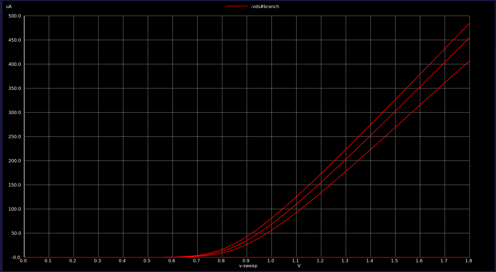

# NMOS Characteristics Analysis

## 1. Introduction
This document presents an analysis of the NMOS transistor characteristics, focusing on its **Id-Vg** (transfer) and **Id-Vd** (output) curves. These characteristics provide insights into the behavior of the NMOS device in various operating regions, including cutoff, linear, and saturation.

---

## 2. Id-Vg Characteristics

### Description
The **Id-Vg** characteristic shows how the drain current (Id) varies with the gate-to-source voltage (Vgs) for a fixed drain-to-source voltage (Vds). This is essential for determining the threshold voltage (Vth) and analyzing the NMOS device's switching behavior.

### Observations
- The drain current (Id) is negligible when Vgs is below the threshold voltage (Vth).
- As Vgs exceeds Vth, the drain current increases rapidly, indicating the onset of conduction.
- In the saturation region, Id increases quadratically with Vgs.

### Plot

---

## 3. Id-Vd Characteristics

### Description
The **Id-Vd** characteristic illustrates the relationship between the drain current (Id) and the drain-to-source voltage (Vds) for various gate-to-source voltages (Vgs). This helps in understanding the NMOS behavior in the linear and saturation regions.

### Observations
- At low Vds, the NMOS operates in the linear region, where Id increases almost linearly with Vds.
- As Vds increases, the device enters saturation, where Id becomes relatively constant for a given Vgs.
- The transition point between linear and saturation regions is determined by the condition Vds = Vgs - Vth.

### Plot

---

## 4. Key Parameters

- **Threshold Voltage (Vth):** Voltage at which the NMOS begins to conduct significantly.
- **Transconductance (gm):** Indicates the rate of change of Id with respect to Vgs in the saturation region.
- **Output Resistance (r₀):** Reflects the slope of the Id-Vd curve in the saturation region.

---

## 5. Observations and Conclusion

The analysis of **Id-Vg** and **Id-Vd** characteristics highlights the following:
- The threshold voltage (Vth) was observed to be approximately `X.X V`.
- In the linear region, the NMOS demonstrates ohmic behavior, while in the saturation region, it exhibits constant current behavior.
- The plots and parameters derived from this analysis serve as a foundation for designing CMOS inverters and other digital/analog circuits.

---

### Future Work
- Perform temperature variation analysis to observe its impact on Vth and Id.
- Extend the study to include PMOS characteristics for a complete CMOS inverter design.
